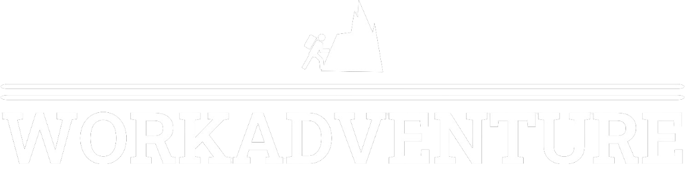

<p align="center">
  <a href="" rel="noopener">
 </a>
</p>

<h1 align="center">Work Adventure : Mobile App</h1>


<p align="center"> Projet de deuxième année d'école d'ingénieur, en React Native.
    <br> 
</p>

## 📝 Table of Contents
- [About](#about)
- [Getting Started](#getting_started)
- [Built Using](#built_using)
- [Authors](#authors)

## 🧐 About <a name = "about"></a>
Work Adventure is a mobile application allowing the ENSC students to share their internship experiences, by telling the company they were in and all the tasks they had to do.

This permits future students to have a concrete idea of what could be expected from them in a given internship.


## 🏁 Getting Started <a name = "getting_started"></a>
These instructions will let you know how to launch the project on your local machine.

### Prerequisites
First and foremost, you need to make sure that you have dotnet and EntityFramework Core installed on your computer.

```

```

### Launch the app
When on the programs directory, you need to launch the app using the method **run**.

```
```

Once the command executed, the terminal will indicate that the software is listening on a certain port

```
```
If the navigator doesn't start automatically after **run** execution, you'll have to copy and paste the adress.

In case of the first port not working, you may want to try with the second link.
<!--
## 🔧 Running the tests <a name = "tests"></a>
Explain how to run the automated tests for this system.

### Break down into end to end tests
Explain what these tests test and why

```
Give an example
```

### And coding style tests
Explain what these tests test and why

```
Give an example
```
-->
<!-- ## 🎈 Usage <a name="usage"></a>
Add notes about how to use the system. -->

<!-- ## 🚀 Deployment <a name = "deployment"></a>
Add additional notes about how to deploy this on a live system. -->

## ⛏️ Built Using <a name = "built_using"></a>
 - [C#](https://dotnet.microsoft.com/en-us/languages/csharp/) - Back-end API  
- [React Native](https://dotnet.microsoft.com/en-us/learn/aspnet/what-is-aspnet-core/) - App development


## ✍️ Authors <a name = "authors"></a>
- [@tristangclvs](https://github.com/tristangclvs) - ENSC 2A / Groupe 1
- [@Zoko91](https://github.com/Zoko91) &nbsp;&nbsp;&nbsp;&nbsp;&nbsp; - ENSC 2A / Groupe 1


<br><br><br>
<p align="center">
 
</p>
